# Databricks Analytics Platform

[](https://www.python.org/downloads/)
[](https://docs.databricks.com/)
[](https://delta.io/)
[](https://mlflow.org/)
[](https://opensource.org/licenses/MIT)

> End-to-end analytics platform on Databricks featuring Delta Lake medallion architecture, MLflow experiment tracking, Unity Catalog governance, and automated data pipelines.

---

## Architecture

```mermaid
flowchart LR
    subgraph Sources["Data Sources"]
        S1[Cloud Storage<br/>JSON / CSV / Parquet]
        S2[Streaming Events]
        S3[Third-Party APIs]
    end

    subgraph Bronze["Bronze Layer — Raw Ingestion"]
        B1[Auto Loader<br/>Schema Evolution]
        B2[Deduplication &<br/>Audit Columns]
        B3[Bad Record<br/>Quarantine]
    end

    subgraph Silver["Silver Layer — Cleaned & Conformed"]
        SV1[Type Casting &<br/>Standardization]
        SV2[Data Quality<br/>Checks]
        SV3[SCD Type 2<br/>Merge Logic]
        SV4[PII Masking]
    end

    subgraph Gold["Gold Layer — Business Aggregates"]
        G1[Daily Active Users]
        G2[Revenue Metrics]
        G3[Retention Cohorts]
        G4[Customer LTV]
    end

    subgraph ML["ML & Analytics"]
        M1[Feature Store]
        M2[Model Training<br/>XGBoost / SparkML]
        M3[MLflow Registry]
        M4[Batch & Real-Time<br/>Inference]
    end

    subgraph Governance["Unity Catalog"]
        UC1[Data Lineage]
        UC2[Access Policies]
        UC3[Column Masking]
    end

    Sources --> Bronze
    Bronze --> Silver
    Silver --> Gold
    Silver --> ML
    Gold --> ML
    Governance -.->|governs| Bronze
    Governance -.->|governs| Silver
    Governance -.->|governs| Gold
```



---

## Tech Stack

| Layer | Technology |
|---|---|
| **Compute** | Databricks Runtime 14.3 LTS, Apache Spark 3.5 |
| **Storage** | Delta Lake 3.1, Unity Catalog Managed Tables |
| **ML / AI** | MLflow 2.12, XGBoost, Hyperopt, Databricks Feature Store |
| **Governance** | Unity Catalog, Row-Level Security, Column Masking |
| **Infrastructure** | Terraform, Azure / AWS Databricks Workspace |
| **CI / CD** | GitHub Actions, Databricks Asset Bundles |
| **Testing** | pytest, PySpark Test Fixtures, Great Expectations patterns |

---

## Features

- **Medallion Architecture** — Bronze, Silver, and Gold layers with Auto Loader streaming ingestion, data quality enforcement, and business-level aggregations.
- **ML Workflows** — End-to-end model training pipeline with hyperparameter tuning (Hyperopt + SparkTrials), cross-validation, and automated model registration.
- **Feature Store** — Centralized feature management with point-in-time lookups, freshness monitoring, and online store publishing.
- **Unity Catalog Governance** — Fine-grained access control, row-level security, column masking, and full data lineage tracking.
- **Infrastructure as Code** — Terraform modules for provisioning Databricks workspaces, cluster policies, instance pools, and secret scopes.
- **CI / CD** — GitHub Actions pipeline for linting, testing, notebook validation, and automated deployment to staging.

---

## Prerequisites

- **Databricks Workspace** (Azure or AWS) with Unity Catalog enabled
- **Databricks Runtime 14.3 LTS** or higher
- **Python 3.10+**
- **Terraform >= 1.5** (for infrastructure provisioning)
- **GitHub CLI** (`gh`) for CI/CD integration

### Python Dependencies

```
pyspark>=3.5.0
delta-spark>=3.1.0
mlflow>=2.12.0
xgboost>=2.0.0
hyperopt>=0.2.7
databricks-sdk>=0.20.0
databricks-feature-engineering>=0.4.0
pytest>=8.0.0
```

---

## Getting Started

### 1. Provision Infrastructure

```bash
cd terraform/
terraform init
terraform plan -var-file="environments/dev.tfvars"
terraform apply -var-file="environments/dev.tfvars"
```

### 2. Configure Unity Catalog

Run the SQL scripts in order against your Databricks SQL warehouse:

```bash
# 1. Create catalogs, schemas, and tables
databricks sql execute --file unity-catalog/setup_catalog.sql

# 2. Configure access policies
databricks sql execute --file unity-catalog/access_policies.sql
```

### 3. Run the Data Pipeline

```bash
# Ingest raw data into Bronze
python delta-lake/bronze/ingest_raw_data.py

# Transform and clean into Silver
python delta-lake/silver/transform_clean.py

# Build Gold aggregations
python delta-lake/gold/aggregate_metrics.py
```

### 4. Train Models

```bash
# Run the full ML training pipeline
python ml-workflows/train_pipeline.py

# Or run hyperparameter tuning
python ml-workflows/hyperparameter_tuning.py
```

### 5. Run Tests

```bash
pytest tests/ -v --tb=short
```

---

## Project Structure

```
databricks-analytics-platform/
├── README.md
├── .gitignore
├── .github/
│   └── workflows/
│       └── databricks-ci.yml          # CI/CD pipeline
├── notebooks/
│   ├── 01_exploratory_data_analysis.py # EDA notebook (Databricks format)
│   ├── 02_feature_engineering.py       # Feature engineering pipeline
│   ├── 03_model_training.py           # Model training with MLflow
│   └── 04_model_inference.py          # Batch & real-time inference
├── delta-lake/
│   ├── pipeline_config.yml            # Pipeline configuration
│   ├── bronze/
│   │   └── ingest_raw_data.py         # Auto Loader streaming ingestion
│   ├── silver/
│   │   └── transform_clean.py         # Data quality & SCD Type 2
│   └── gold/
│       └── aggregate_metrics.py       # Business KPI aggregations
├── ml-workflows/
│   ├── train_pipeline.py              # End-to-end training pipeline
│   ├── hyperparameter_tuning.py       # Hyperopt + SparkTrials tuning
│   ├── model_registry.py             # MLflow Model Registry operations
│   └── feature_store.py              # Feature Store management
├── unity-catalog/
│   ├── setup_catalog.sql              # Catalog & schema setup
│   ├── data_lineage.sql              # Lineage tracking queries
│   └── access_policies.sql           # RBAC & column masking
├── terraform/
│   ├── main.tf                        # Workspace provisioning
│   ├── variables.tf                   # Input variables
│   └── outputs.tf                     # Output values
└── tests/
    ├── test_transformations.py        # Silver/Gold transform tests
    └── test_data_quality.py           # Data quality check tests
```

---

## Contributing

1. Fork the repository
2. Create a feature branch (`git checkout -b feature/my-feature`)
3. Follow existing code style and add tests for new functionality
4. Run the test suite: `pytest tests/ -v`
5. Commit with conventional commit messages (`feat:`, `fix:`, `docs:`, etc.)
6. Open a Pull Request against `main`

---

## License

This project is licensed under the MIT License. See [LICENSE](LICENSE) for details.
